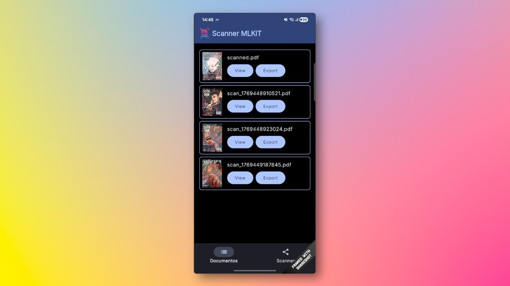
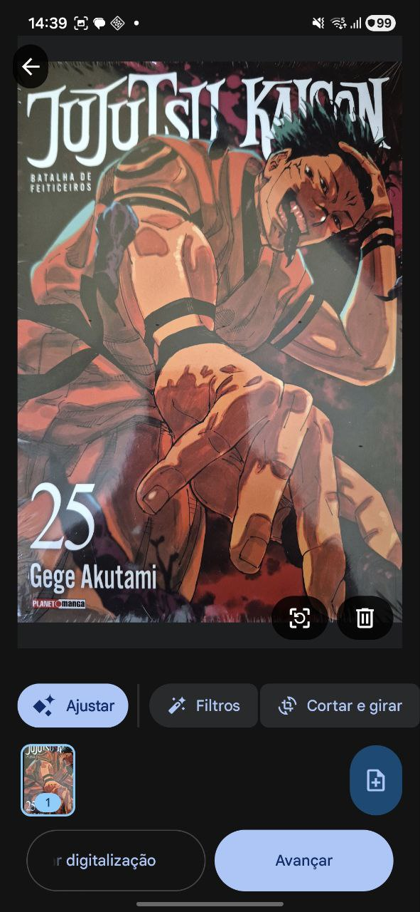
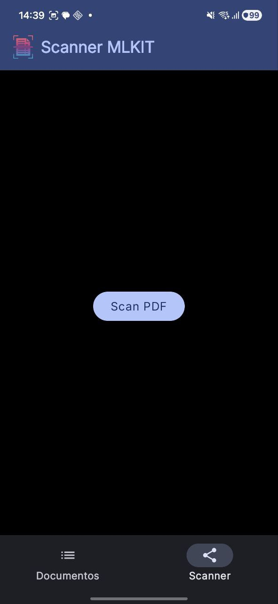

<div>


</div>

# Scanner ML Kit

Este é um projeto para Android desenvolvido com Jetpack Compose que demonstra o uso de diversas ferramentas do Google (ML Kit) e bibliotecas avançadas (como iTextPDF e CameraX) para oferecer uma suíte de digitalização completa.

## Descrição

O aplicativo evoluiu para ser muito mais do que um simples scanner de documentos, oferecendo agora funcionalidades para o gerenciamento de PDFs e leitura de códigos de barras/QR Codes, tudo construído sobre uma interface moderna baseada no Material Design 3.

As principais funcionalidades incluem:

*   **Digitalização de Documentos:** Escaneie documentos físicos, faça recortes e aplique filtros automaticamente usando o [Document Scanner do Google ML Kit](https://developers.google.com/ml-kit/vision/document-scanner). O documento escaneado é salvo diretamente como um arquivo PDF.
*   **Leitura de QR Code / Código de Barras:** Digitalize e interprete rapidamente dados de um QR Code ou código de barras através da câmera do dispositivo em tempo real, utilizando CameraX e a API de [Barcode Scanning do ML Kit](https://developers.google.com/ml-kit/vision/barcode-scanning).
*   **Mesclagem de PDFs (Merge):** Junte múltiplos documentos PDF em um único arquivo de forma simples utilizando a robusta biblioteca [iTextPDF](https://itextpdf.com/).
*   **Listagem e Gerenciamento:** A tela principal exibe uma lista de todos os documentos PDF gerados ou mesclados, apresentando uma prévia da primeira página. O usuário tem as opções de:
    *   **Visualizar**: Abrir o PDF em um visualizador externo no dispositivo.
    *   **Exportar/Compartilhar**: Compartilhar e enviar o arquivo PDF via e-mail e outros aplicativos.

## Preview

<div>


</div>

## Tecnologias e Dependências

Este projeto utiliza diversas tecnologias, frameworks e bibliotecas modernas do ecossistema Android:

*   **[Kotlin](https://kotlinlang.org/)**: Linguagem de programação oficial e recomendada.
*   **[Jetpack Compose](https://developer.android.com/jetpack/compose)**: Toolkit para a construção de interfaces de usuário (UI) de forma declarativa e nativa.
*   **[Material Design 3](https://m3.material.io/)**: Componentes visuais modernos e adaptativos (utilizando `Adaptive Navigation Suite` para múltiplas telas).
*   **[Google ML Kit Document Scanner](https://developers.google.com/ml-kit/vision/document-scanner)**: Responsável por toda a parte de detecção, perspectiva e melhoria visual das digitalizações.
*   **[Google ML Kit Barcode Scanning](https://developers.google.com/ml-kit/vision/barcode-scanning)**: Motor ultrarrápido do Google para detecção e decodificação de códigos 1D e 2D.
*   **[CameraX](https://developer.android.com/training/camerax)**: Biblioteca da API do Jetpack que abstrai a complexidade do hardware de câmera.
*   **[iTextPDF 9](https://itextpdf.com/en/products/itext-7/itext-pdf-android)**: Ferramenta open-source poderosa que efetua a criação e mesclagem (`kernel-android`, `io-android`, `layout-android`) dos arquivos em formato PDF.
*   **[Coil 3](https://coil-kt.github.io/coil/)**: Extensão leve e recomendada para o descarregamento e exibição de imagens assíncronas em telas do Compose.
*   **Outros componentes do AndroidX**: `ViewModel`, `Navigation Compose`, `Accompanist Permissions`, e mais.

## Uso

1.  Clone o repositório.
2.  Abra o projeto via Android Studio.
3.  Aguarde a sincronização completa do Gradle com todas as dependências do projeto.
4.  Execute o aplicativo em um emulador ou em um dispositivo Android físico.
5.  Navegue de forma intuitiva pelas guias principais na parte inferior do App ("Scanner", "QR Code", e "Merge").
6.  **Digitalizar Documentos**: Acione o Scanner ML Kit para fotografar apostilas, papéis ou importar da galeria.
7.  **Leitor QR**: Aponte a câmera e as informações relativas ao link ou texto irão aparecer.
8.  **Juntar PDFs**: Clique no ícone de "Merge" e selecione no armazenamento do seu aparelho 2+ documentos que gostaria de unir em um único arquivo.

## Licença

```text
Copyright 2024 Davi Gomes Florencio

Licensed under the Apache License, Version 2.0 (the "License");
you may not use this file except in compliance with the License.
You may obtain a copy of the License at

    http://www.apache.org/licenses/LICENSE-2.0

Unless required by applicable law or agreed to in writing, software
distributed under the License is distributed on an "AS IS" BASIS,
WITHOUT WARRANTIES OR CONDITIONS OF ANY KIND, either express or implied.
See the License for the specific language governing permissions and
limitations under the License.
```
